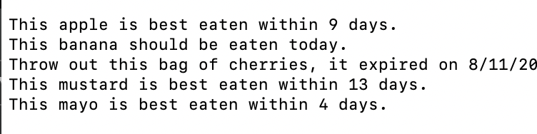

# Final

## Project Goals
The goal of this project is to show proficiency with:
1.	**makefiles**.
2.  **class** building skills.
3.  **array of objects** and **object pointer** creation and manipulation.
4.  **class aggregation and inheritance** skills.
5.  **Abstract Base Class** and **Template** skills.
6.  **Function Overloading** and **Friend Function** skills.
### Important Notes:
1.	**Formatting**: Make sure that you follow the precise recommendations for the output content and formatting. Failure to do so will result in 1 point off for each error.
2.	**Comments**: Header comments are required in the driver and recommended for the rest of the program. Points will be deducted if no header comments are included.

## Program
Your project should include the following files:
- driver.cpp  
- date.cpp  
- date.h  
- food.cpp  
- food.h
- fruits.cpp  
- fruits.h  
- condiments.h    
- condiments.cpp  
- fridge.h  
- fridge.cpp  
- makefile  

Your executable should be named ```food```  

## Programming Problem
You have been provided with all of the necessary files, though some are incomplete and others are empty, and some are perfectly fine. Your job is to fix the program so that the main function in driver.cpp works **without any modification**. Modifying the main function in driver.cpp will result in a **25% grade reduction**.

Write a program that checks the contents of a fridge, and outputs whether a food is safe to eat, and if it is, how much time is left before it goes bad. You should not need to modify main() or any of the includes in the files, unless told otherwise (fruits/condiments) or writing the class from scratch (fridge)

### The example executable:
An example executable is provided in this repository. You should be able to run it from your project folder.
If you encounter a “permission denied” error when attempting to run the executable, type ```chmod u+x foodEx``` into the terminal and try running the executable again.   

### The example output:
If you can't run the executable for any reason, your output should look like this:   '
  
## Requirements
```
driver.cpp

```
*main()*  
This function should not be altered in **any way**. Doing so will result in a 25% grade reduction.

*convertDaysToDate()*    
**Input Parameters**: integer number of days between today and bestBy date, a template food    
**Returned Output**: none    
**Functionality**: This function should calculate the number of years, months, and days from the number of days parameter. Year, month, and day should be used to create a date object, and that object should be passed to outputFoodStatus(). Assume that there are 365 days in a year, and 30 days in a month to make this function easier to write.    

*outputFoodStatus()*  
**Input Parameters**: integer number of days, date remaining shelf life (calculated in convertDaysToDate and passed in), a template food  
**Returned Output**: none  
**Functionality**: This function should use the date object to determine if a food has passed its expiration date + any leeway time that was provided in checkIfSafeToEat(). If the food is safe to eat, the food's name should be output. If this is the last day the food is safe to eat, "should be eaten today." is displayed to the terminal. If the food is safe to eat and this isn't the last day that it's safe to eat, "is best eaten within " should be displayed, followed by the number of years, months, and days that remain in the food's shelf life. Note: if the year or month are 0, you should not print them. Finally, if the food is not safe to eat, you should output the food's name and a period.  

**Don't forget to add your function prototypes to driver.cpp!**


```
date.h & date.cpp  
```
**Functionality**: These files should contain the definition and implementation for the date class. Add an overloaded extraction operator to this class, and make it a friend function. **You decide where to put the implementation of the friend function.**   Hint, there's really only one place it makes sense to implement it.
```
food.h & food.cpp  
```
**Functionality**: This header file and cpp file should create an abstract base class called food. You will need to determine which method makes the class abstract (hint, look for a repeated method in the two food children, you may need to add it). Implement the abstract base class.

```
fruits.h & fruits.cpp  
```
**Functionality**: This class should be modified to inherit from the food abstract base class, and include the appropriate files. Modify the class so that it implements checkIsSafeToEat() from the abstract base class. Fruits can still be considered safe to eat for up to 7 days after the bestBy date. 

```
condiments.h & condiments.cpp  
```
**Functionality**: This class should be modified to inherit from the food abstract base class. Modify the class so that it implements checkIsSafeToEat() from the abstract base class. condiments can still be considered safe to eat for up to 4 days after the bestBy date. 

*checkIsSafeToEat()*    
**Input Parameters**: a date    
**Output Parameters**: number of days the food is still safe for (can be negative if food is spoiled)    
**Functionality**: This function should calculate the number of days in the passed in date, and in the bestBy date (should not be passed in). Find the difference between the two values, and add the number of days that that food subtype is considered safe to eat for. Note that this method should exist in food, fruits, and condiments in different capacities, and (sometimes) with different extra safe day values.    

```
fridge.h
```
**Functionality**: This class aggregates the fruits and condiments classes, and should contain the definition for the following attributes and methods:  
```
fruits fruit bin array
condiments bin array
int number of fruits
int number of condiments
```
```
fridge.cpp
```
**Functionality**: This file should contain the function definitions for the following functions:

*Constructors*  
- default constructor
- parameterized contructor
- copy constructor 

*Getters*  
Getter functions for each attribute.

**NOTE: THERE ARE NO SETTERS IN THIS CLASS -> JUST CONSTRUCTORS, GETTERS, AND ADDERS (which do the setting)


*addFruitToFridge*      
**Input Parameters**: a fruit    
**Returned Output**: none    
**Functionality**: This function should add a fruit to the fruit bin array, and update the value of the number of fruits    

*addCondimentToFridge()*  
**Input Parameters**: a fruit    
**Returned Output**: none    
**Functionality**: This function should add a fruit to the fruit bin array, and update the value of the number of fruits    

## **Part 2 (20 Points)**
### Answer each of the following questions in this README file. This should take anywhere from 3-5 sentences per question.

1. Which of the 4 pillars of object oriented programming are exhibited by this program? Provide an example of each pillar that is exhibited, and explain why it is an example of that pillar.

Encapsulation: This is evident in the program with the usage of fridge class, which manages access to the bins of fruit and condiments within said fridge.

Inheritance: This is demonstrated in the implementation of the 'food' parent class, which has 2 children which inherit properties and methods from it.

Polymorphism: This exists within the "checkIfSafeToEat" function, which although is defined in the parent class, is still implemented with some differences within the children classes.

Abstraction: This can be seen in the convertDaysToDate and convertDateToDay functions, in which the user can just invoke a function to convert between days and dates without needing to know how either functions work under the hood.


2. Which of the SOLID principles are exhibited by this program? Provide an example of each that is exhibited, and explain why it is an example of that principle.

Single-responsibility: 'checkIfSafeToEat' is an example of this principle since it does what its name suggests without doing anything more.

Open-closed: Each of the children classes of the parent 'food' class exhibit the idea of open-closedness since instead of having to modify the parent class for any specialized modfications, we can just modify the children classes.

Liskov: Both children classes of the food class are able to act as the food class if it were needed to be implemented since they only add to the parent class without taking any features away.

Interface Segregation: The getters of the food class are an example of this principle since they aren't dependent on any other code.

Dependency Inversion: The food class includes date.h, but none of the children include it because it is passed through the inclusion of the parent class.


3. Throughout the semester, I've told you that there are typically many different ways to write the same program.  What changes could be made to this code to better embody SOLID and the 4 pillars of OOP? Explain. 

One change I would make is to turn the food class into a pure virtual class since  it is never implemented and could return the include overhead of the fridge class, which must include food.h twice; doing this would better the dependency inversion portion of solid by passing the food class to the fridge class more efficient in terms of resource usage.


## Submission details
To submit your project, you will have to use git on your VirtualBox installation:
1.	After accepting the assignment invitation, copy the clone URL
2.	Type 
```git clone clone URL```
3.	cd into your new assignment directory
4.	After working on your files
5.	When you’re ready, type the following commands: 
```
git add .
git commit -m “a descriptive message!”
git push
```
## Academic Honesty
Academic dishonesty is against university as well as the system community standards. Academic dishonesty includes, but is not limited to, the following:
Plagiarism: defined as submitting the language, ideas, thoughts or work of another as one's own; or assisting in the act of plagiarism by allowing one's work to be used in this fashion.
Cheating: defined as (1) obtaining or providing unauthorized information during an examination through verbal, visual or unauthorized use of books, notes, text and other materials; (2) obtaining or providing information concerning all or part of an examination prior to that examination; (3) taking an examination for another student, or arranging for another person to take an exam in one's place; (4) altering or changing test answers after submittal for grading, grades after grades have been awarded, or other academic records once these are official.
Cheating, plagiarism or otherwise obtaining grades under false pretenses constitute academic
dishonesty according to the code of this university. Academic dishonesty will not be tolerated and
penalties can include cancelling a student’s enrolment without a grade, giving an F for the course, or for the assignment. For more details, see the University of Nevada, Reno General Catalog.
